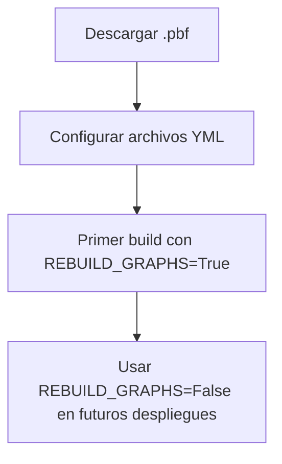

### 🔍 **Pasos para agregar el mapa de Chile**

1. **Descargar el archivo .osm.pbf**

```bash
wget https://download.geofabrik.de/south-america/chile-latest.osm.pbf -P ./ors-docker/files/
```

2. **Modificar `ors-config.yml`:**
    - En el archivo `ors-config.yml`, cambia la ruta del `source_file`:

```yaml
ors:
  engine:
    profile_default:
      build:
        source_file: /home/ors/files/chile-latest.osm.pbf  # Nueva ruta
```

3. **Asegurar montaje de volúmenes en `docker-compose.yml`:**
    - Descomenta estas líneas para montar el directorio de archivos:

```yaml
volumes:
  - ./ors-docker:/home/ors
  - ./graphs:/home/ors/graphs
  - ./elevation_cache:/home/ors/elevation_cache
  - ./config:/home/ors/config
  - ./logs:/home/ors/logs
  - ./files:/home/ors/files  # <-- Importante para tu .pbf
```

4. **Configurar reconstrucción de grafos:**
    - En `docker-compose.yml`, activa la reconstrucción de grafos:

```yaml
environment:
  REBUILD_GRAPHS: True  # Solo para el primer despliegue
  XMS: 4g  # Ajusta según tamaño del archivo .pbf
  XMX: 8g  # Regla general: tamaño_archivo_pbf * 2 * nº_perfiles
```

5. **Reiniciar el contenedor:**

```bash
docker compose down && docker compose up -d --build
```


---

### ⚠️ **Consideraciones clave**

- **Tamaño del archivo:** El archivo de Chile (~650 MB comprimido) requerirá más memoria. Ajusta `XMS/XMX` según [esta guía](https://giscience.github.io/openrouteservice/run-instance/configuration/#memory-configuration).
- **Perfiles activos:** En `ors-config.yml`, configura solo los perfiles necesarios (ej: `driving-car`, `cycling-regular`).
- **Monitoreo:** Activa el healthcheck en `docker-compose.yml` para verificar el estado del servicio.

---

### 🔄 **Flujo de trabajo recomendado**



---

### 🛠️ **Solución de problemas comunes**

- **Permisos:** Si hay errores de escritura:

```bash
sudo chown -R 1000:1000 ors-docker/
```

- **Logs detallados:** Cambia `CONTAINER_LOG_LEVEL` a `DEBUG` en `docker-compose.yml`.
- **Prueba de funcionamiento:**

```bash
curl "http://localhost:8080/ors/v2/directions/driving-car?start=-70.6483,-33.4569&end=-70.6683,-33.4490"
```


¿Necesitas ayuda con algún paso específico o ajustes adicionales para tu caso de uso? 🗺️

<div style="text-align: center">⁂</div>

[^1]: https://ppl-ai-file-upload.s3.amazonaws.com/web/direct-files/54262150/c0ac8439-d12b-409d-b165-2d54dc897301/docker-compose.yml

[^2]: https://ppl-ai-file-upload.s3.amazonaws.com/web/direct-files/54262150/b5d27889-9bcf-49ac-a8bc-f83078a9387a/README.md

[^3]: https://ppl-ai-file-upload.s3.amazonaws.com/web/direct-files/54262150/862c2b10-7d36-4a30-8d4d-6fbe1a797460/ors-config.yml

[^4]: https://ppl-ai-file-upload.s3.amazonaws.com/web/direct-files/54262150/aebf9e2c-3bbc-480c-ae51-0c47056f0681/docker-entrypoint.sh

[^5]: https://download.geofabrik.de/south-america/chile-latest.osm.pbf

