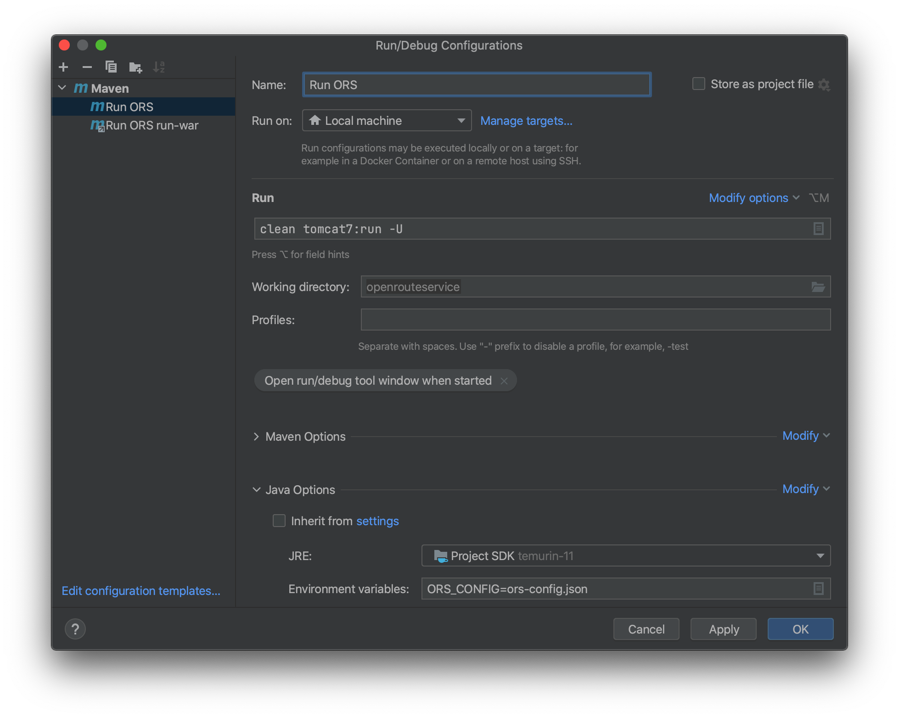

# Opening openrouteservice code in IntelliJ

Though IntelliJ provides functionality to directly clone a repository, the steps below are the general procedure for getting openrouteservice up and running in IntelliJ:
1. Clone the repository into a folder.
2. Open IntelliJ. In the menu, go to **File -> New -> Project from Existing Source**.
3. Select the folder that was just cloned (it should contain the subfolders of docker, openrouteservice, and openrouteservice-api-tests) and click OK.
4. Select the option for **"Create Project from Existing Source"**.
5. When you reach a page asking to "choose directories that will be added as project roots", **deselect all items** and then click "Next".
6. When the project has been loaded, you should only see the files that are contained in the root openrouteservice folder and no subdirectories.
7. Click **File -> Project Structure.**
8. In the Project tab, **select 1.11 as the Java SDK**.
9. Go to the **Modules tab** and add the following modules one by one each time clicking the **"+" Button**, selecting **"Import Module"** and using the following settings:

|Folder| Import settings |
|------|---------|
|./openrouteservice/openrouteservice| Import module from external model ->  Maven|
|./openrouteservice/docker| Import module from external model -> Maven |
|./openrouteservice/openrouteservice-api-tests| Create module from existing sources|

10. Click "Apply" and close the window.

# Set run configurations in IntelliJ

1. In the menu open **Run -> Edit Configurations ...**
2. **Click the "+" button** and select **Maven** to create a new configuration.
3. In the folder
"./openrouteservice/openrouteservice/src/main/resources", copy the file _**ors-config-sample.json**_ and save it as _**ors-config.json**_.
4. In the ors-config.json file you may have to adapt the paths to your local OSM file and logging directory if they don't exist on your computer.

  ``` json
  {
    "ors": {
      ...
      "services": {
        ...
        "routing": {
          ...
          "sources": ["path/to/your/osm_file.osm.gz"],
          ...
        }
      },
      "logging": {
        ...
        "location": "path/to/your/logs",
        ...
      },
      ...
    }
  }
  ```

5. Choose the settings according to the following tables:

  | Parameter              | Value                            |
  |------------------------|----------------------------------|
  | Run on                 | Local machine                    |
  | Run command            | clean tomcat7:run -U             |
  | Working directory      | openrouteservice                 |
  | Environment variables  | ORS_CONFIG=ors-config.json       |

  Using these settings, **cross-origin requests will not be permitted**. If you need this to be possible, use the run command `clean tomcat7:run-war`. Running this command will create the files `ors.war` and `./ors/WEB-INF/web.xml` inside the target folder. Within the `web.xml` file the CORS settings will be set to `cors.allowed.origins`.

  

6. Run ORS using **Run -> Run 'Run ORS'**
