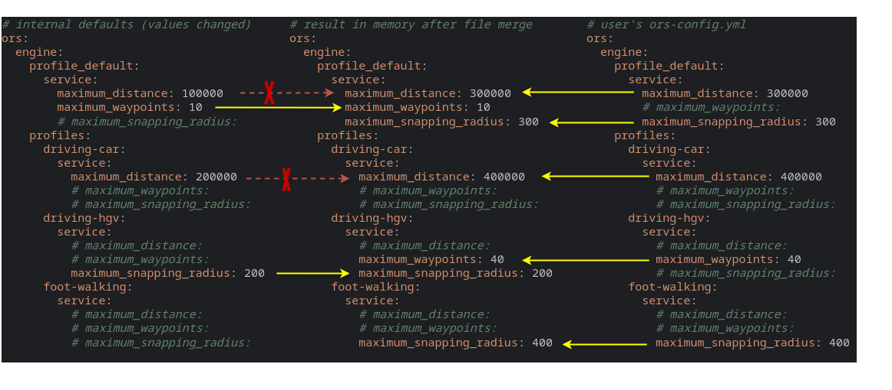
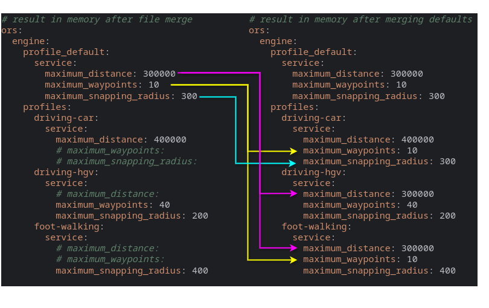

# How to configure openrouteservice

In this chapter we handle different dimensions of the configuration topic:

* [Different Notations](#different-notations) for the same configuration properties
* [Internal defaults](#internal-defaults): Where are those defined, how to view the internal default values
* [Different ways to set individual Values](#different-ways-to-set-individual-values)
    * Place a [Default Config File](#default-config-file) named `ors-config.yml` in one of the directories where
      openrouteservice looks for it
    * or specify a [Custom Config File](#custom-config-file)
    * override properties with [Environment variables](#environment-variables) in the shell or in an environment file
    * override properties with [JVM Program Arguments](#jvm-program-arguments)
    * override properties with [Spring Run Arguments](#spring-run-arguments)
    * [**Priority of these different property sources**](#priority-of-these-different-property-sources)
* [Docker Scenarios](#docker-scenarios)
* [Defining defaults for all routing profiles](#defining-defaults-for-all-routing-profiles) in
  `ors.engine.profile_default`
* [Graph build properties loaded from graph directories](#graph-build-properties-loaded-from-graph-directories)

## Different Notations

The configuration of openrouteservice can be specified in different notations.
Which format to best use in which scenario is documented in the config documentations for
[JAR](/run-instance/running-jar.md), [WAR](/run-instance/running-war.md)
and [Docker](/run-instance/running-with-docker.md).

* `.yml` is the default configuration format since version 8. You can find
  an [example configuration file](https://github.com/GIScience/openrouteservice/blob/main/ors-config.yml) with all
  available configuration options. Only a minimal set of properties is active, all others are commented out.
* `.env` files for Docker setup. There is also
  an [example env file](https://github.com/GIScience/openrouteservice/blob/main/ors-config.env) that you can download
  and customize.
* `.json` config file: In the past openrouteservice was configured [via JSON file](json.md). This configuration method
  has been **deprecated** and removed in ORS version 9. Therefore, we strongly discourage you from using it. If you
  have an old JSON config, please consider
  to [migrate to the new config](https://github.com/GIScience/ors-config-migration#usage).

All of the above described config files can contain the same logic application properties.

For example, the property `ors.engine.profiles.car.enabled` would look like this

in `*.yml`

```yaml
ors:
    engine:
        profiles:
            driving-car:
                enabled: true
```

in `*.env` one of

```shell
ors.engine.profiles.driving-car.enabled=true
ORS_ENGINE_PROFILES_DRIVING_CAR_ENABLED=true
```

as Spring or JVM run parameter

```shell 
ors.engine.profiles.driving-car.enabled=true
```

::: tip
In this documentation we mostly use the dot notation to name a configuration property
because it is more compact than e.g. YAML style with line breaks and indentation
and better readable than uppercase-underscore environment variable style.
:::

## Internal Defaults

openrouteservice has sensible defaults and can be started with a minimal configuration,
see [What to configure](what-to-configure#minimal-configuration).
The internal default values are defined in the file
[
`ors-api/src/main/resources/application.yml`](https://github.com/GIScience/openrouteservice/blob/main/ors-api/src/main/resources/application.yml).

Besides default values for most configuration properties,
there are also **default routing profiles** for all supported modalities with sensible defaults for each of them.
These default profiles have the names of their flag encoders.
For more details see [profiles](engine/profiles/index.md).

The openrouteservice [releases](https://github.com/GIScience/openrouteservice/releases) also contain downloadable
example `ors-config.yml` and `ors-config.env` files as release assets,
where all properties with their defaults are included as commented lines.

### Configuration defaults output

Since version 9.0.0, openrouteservice offers the option to output the default configuration at startup.
This can be useful for debugging purposes, or to generate a template for a custom configuration file containing all
defaults.
To enable this feature, set the parameter `ors.engine.config_output` to the target file name before starting
openrouteservice.
The output will be written to a file of that name, the extension `.yml` will be added if not supplied.

```yaml
ors:
    engine:
        config_output: ors-config-example.yml
```

Alternative ways to set this option are Spring runtime parameters, Java VM runtime parameters or environment variables
as
described above apply. All the following commands can be used to the same effect:

* Spring runtime parameters:

```shell 
java -jar ors.jar --ors.engine.config_output=ors-config-example.yml
```

* JVM runtime parameters:

```shell 
java -jar -Dors.engine.config_output=ors-config-example.yml ors.jar 
```

* Environment variables:
    ```shell 
    export ors.engine.config_output=ors-config-example.yml
    java -jar ors.jar 
    ```
  or
    ```shell 
    export ORS_ENGINE_CONFIG_OUTPUT=ors-config-example.yml
    java -jar ors.jar 
    ```

::: warning Hint
The exported file contains the internal defaults,
NOT the merge result of all used configuration sources!
:::

## Different ways to set individual Values

Custom configuration properties can be set with configuration files, environment variables and start parameters:

### Default Config File

If no config location is specified (see [below](#custom-config-file)),
openrouteservice is looking for a configuration file named `ors-config.yml` in the locations below in that order.
The first existing file (and only this one) is used as configuration source.

| Path                                        | Description                    |
|:--------------------------------------------|:-------------------------------|
| `./ors-config.yml`                          | Current working directory      |
| `~/.config/openrouteservice/ors-config.yml` | User configuration directory   |
| `/etc/openrouteservice/ors-config.yml`      | Global configuration directory |

When openrouteservice is running in a container, these directories are checked inside the container,
files from outside the container can be mounted.

::: tip
On application start openrouteservice logs which configuration file was loaded.
If running inside a container, the printed path is the internal one.
:::

### Custom Config File

openrouteservice can also use different yml files than `ors-config.yml` as configuration source.
There are two ways to provide openrouteservice the location of a custom configuration file:

1. Program argument
      ```shell 
      java -jar ors.jar /path/to/my-ors-config.yml
      ```
2. Environment variable `ORS_CONFIG_LOCATION`
      ```shell 
      export ORS_CONFIG_LOCATION=/path/to/my-ors-config.yml
      java -jar ors.jar
      ```

If both are specified, the program argument wins.
When a custom config file is used, `ors-config.yml` files are ignored.

### Environment Variables

All or single configuration parameters can be overridden/defined as environment variables.

```shell 
export ors.engine.profile_default.build.source_file=./osm_file.pbf 
export ors.engine.profiles.driving-car.enabled=true
java -jar ors.jar 
```

This is especially useful in contexts where you want to run
openrouteservice in containers such as with [docker](/run-instance/running-with-docker.md).

Every property also corresponds to an environment variable name in *uppercase letters* and with *underscores* replacing
*dots*, so e.g.

- `ORS_ENGINE_PROFILE_DEFAULT_BUILD_SOURCE_FILE` replaces `ors.engine.profile_default.build.source_file`
- `ORS_ENGINE_PROFILES_CAR_ENABLED` replaces `ors.engine.profiles.car.enabled`

Consequently, the following commands are equivalent to the last example above:

```shell
  export ORS_ENGINE_PROFILE_DEFAULT_BUILD_SOURCE_FILE=./osm_file.pbf
  export ORS_ENGINE_PROFILES_CAR_ENABLED=true
  java -jar ors.jar
```

Note, that there are different ways to define environment variables,
e.g.
in [docker compose files](/run-instance/running-with-docker.md#set-openrouteservice-properties-in-docker-compose-yml)
or
[env files](/run-instance/running-with-docker.md#set-openrouteservice-properties-in-an-environment-file)
or in `setenv.sh` files in [tomcat setups](/run-instance/running-war.md#configure).

### JVM Program Arguments

All or single configuration parameters can be overridden/defined as JVM run arguments:

```shell 
java -jar -Dors.engine.profile_default.build.source_file=./osm_file.pbf -Dors.engine.profiles.driving-car.enabled=true ors.jar 
```

### Spring Run Arguments

All or single configuration parameters can be overridden/defined as Spring run arguments:

```shell 
java -jar ors.jar --ors.engine.profile_default.build.source_file=./osm_file.pbf --ors.engine.profiles.driving-car.enabled=true
```

### Priority of these different property sources

If properties are set in several configuration sources,
the priority is as follows. 1 (highest priority) to 5 (lowest):

1. Spring Run Arguments override
2. JVM Program Arguments override
3. Environment Variables override
4. Properties defined in the single used config file override
5. Internal defaults

The following image illustrates, how a config yml overrides some of the internal defaults.
The merge result is shown in the middle.
The red lines are examples for properties defined on both sides - the user config wins.
The commented lines (green) are just included for better readability.



## Docker Scenarios

An openrouteservice instance running in a container works in the same way as described in this chapter.
The difference is, that the openrouteservice has a docker container as its environment,
with a separate file system (different paths) and individual environment variables.
The lookup for configuration files is always related to the internal environment,
this has to be respected when configuring paths in the YAML config or
when specifying the config file in the parameter `ors_config_location`.

Like in a "normal" setup, all configuration properties can be set as environment variables.
This is a more common way for configuring applications in docker containers,
in contrast to applications running directly on the host system,
because in the docker container there is a fresh and independent environment.

[Running with Docker](/run-instance/running-with-docker.md#configure) describes in detail,
how openrouteservice can be configured in docker scenarios.

## Defining defaults for all routing profiles

Besides the overriding mechanisms of different configuration sources,
there is also a way to define defaults for all (enabled) routing profiles:

The structure nested in `ors.engine.profile_default` is the exact same as in each routing profile in
`ors.engine.profiles`.
Each specific routing profile inherits the defaults from `profile_default` and can override or add single properties.

It is important to understand, that `ors.engine.profile_default` and `ors.engine.profiles` are itself configuration
properties
and like all other properties in the hierarchical structure of configuration properties are first merged from all
configuration sources.
The final merge results of these properties are then the base for the internal logic of the defaults for profiles:


One side effect is, that properties of specific profiles, that are defined in the internal defaults,
cannot be overridden by properties in the user's `profile_default`!
In the example above the user has defined `ors.engine.profile_default.maximum_snapping_radius: 300`
but the profile foot-walking has an internal default `400` for this property.
The internal value for the specific profile wins over the user's `profile_default`:



## Graph build properties loaded from graph directories

The configured profile properties in `ors.engine.profiles.<profile>.build` (and `ors.engine.profile_default.build`)
are used to _build_ a graph.
openrouteservice stores these build properties in the file `graphs/<profile>/graph_info.yml` when a graph is computed.

When openrouteservice is _loading_ an existing graph instead of building it,
the persisted build parameters are again loaded from this file,
locally configured build parameters for the affected routing profile are overridden.

Therefore, the file `graph_info.yml` must not be edited!
The content of this file is also used for repository lookups by
the ([Graph Repo Client](/technical-details/graph-repo-client/index.md)). 

