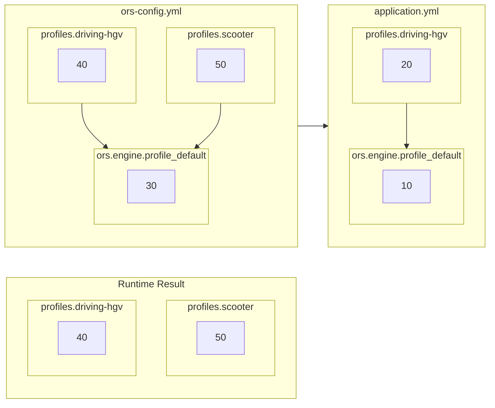

# Configuration

## Formats

The configuration or openrouteservice can be specified in different formats.
Which format to best use in which scenario is documented in the config documentations for
[JAR](../running-jar.md), [WAR](../running-war.md) and [Docker](../running-with-docker.md).

* `.yml` is the default configuration format since version 8. You can find
  an [example configuration file](https://github.com/GIScience/openrouteservice/blob/main/ors-config.yml) with all
  available configuration options. Only a minimal set of properties is active, all others are commented out.
* `.env` files for Docker setup. There is also
  an [example env file](https://github.com/GIScience/openrouteservice/blob/main/ors-config.env) that you can download
  and customize.
* `.json` config file: In the past openrouteservice was configured [via JSON file](json.md). This configuration method
  has been **deprecated** and will be eventually removed. Therefore, we strongly discourage you from using it. If you
  have an old JSON config, please consider
  to [migrate to the new config](https://github.com/GIScience/ors-config-migration#usage).

All of the above described config files can contain the same logic application properties.

For example, the property `ors.engine.profiles.car.enabled` would look like this

in `*.yml`

```yaml
ors:
  engine:
    profiles: 
      driving-car: 
        enabled: true
```

in `*.env`

```shell
ors.engine.profiles.driving-car.enabled=true
```

in `*.properties`

```properties
ors.engine.profiles.driving-car.enabled=true
```

In [Alternative Configuration](#alternative-configuration) you find the syntax to define the property as environment
variable or program argument.

## Location

There are two (optional) ways for you to provide openrouteservice the location of a configuration file:
1. Program argument
      ```shell 
      java -jar ors.jar /path/to/ors-config.yml
      ```
2. Environment variable `ORS_CONFIG_LOCATION`
      ```shell 
      export ORS_CONFIG_LOCATION=/path/to/ors-config.yml
      java -jar ors.jar
      ```

If both are specified, the program argument wins.

If no config location is specified, openrouteservice will look for a configuration file `ors-config.yml` in the locations below in that order.
The first existing file is used as configuration.

| Path                                        | Description                                 |
|:--------------------------------------------|:--------------------------------------------|
| `./ors-config.yml`                          | Current working directory                   |
| `~/.config/openrouteservice/ors-config.yml` | User configuration directory                |
| `/etc/openrouteservice/ors-config.yml`      | Global configuration directory              |

::: tip
At program start openrouteservice reports which configuration file was loaded.
:::

## Properties structure

The properties are organized in a hierarchical structure, with the following ones at top level.
Since openrouteservice is based on spring, all
common [spring properties](https://docs.spring.io/spring-boot/docs/current/reference/html/application-properties.html)
can be set in the `ors-config.yml` file. The most important ones are:

* [Server Properties](server.md)
* [Logging Properties](logging.md)

Other openrouteservice specific properties are organized in the `ors` object:

* [ors.endpoints](endpoints/index.md): Settings required at runtime to process API requests.
* [ors.engine](engine/index.md): Settings required at graph-build time during startup, and settings
  regarding [profiles](engine/profiles/) run on the instance.
* [ors.cors](cors/index.md): Cross-origin resource sharing settings.
* [ors.messages](messages/index.md): System messages that can be sent with API responses following simple rules.

At the very least, openrouteservice needs the configuration to contain at least one
enabled [profile](engine/profiles/profiles.md) and the
reference to an [OSM data file](../data.md#osm-data) to run properly. Therefore, the minimal valid content of such a file
would be, e.g.:

```yaml
ors:
  engine:
    profile_default:
      build:
        source_file: ./osm_file.pbf
    profiles:
      driving-car: 
        enabled: true
```

## Alternative configuration

All configuration parameters can be overridden by runtime parameters or by setting environment variables. At program start openrouteservice reports on every environment variable that *might* have an effect on its behavior. You can run openrouteservice entirely without a configuration file by setting all required properties via environment variables. The examples listed below achieve the same example minimal configuration mentioned above.

The options in order of precedence (higher options win over lower) are: 
- Spring runtime parameter
  ```shell 
  java -jar ors.jar --ors.engine.profile_default.build.source_file=./osm_file.pbf --ors.engine.profiles.driving-car.enabled=true
  ```
- Java VM runtime parameter
  ```shell 
  java -jar -Dors.engine.profile_default.build.source_file=./osm_file.pbf -Dors.engine.profiles.driving-car.enabled=true ors.jar 
  ```
- Environment variables
  ```shell 
  export ors.engine.profile_default.build.source_file=./osm_file.pbf 
  export ors.engine.profiles.driving-car.enabled=true
  java -jar ors.jar 
  ```
  
The option to configure using environment variables is especially useful in contexts where you want to run
openrouteservice in containers such as with [docker](../running-with-docker.md). 

Every property also corresponds to an environment variable name in *uppercase letters* and with *underscores* replacing *dots*, so e.g.
- `ORS_ENGINE_PROFILE_DEFAULT_BUILD_SOURCE_FILE` replaces `ors.engine.profile_default.build.source_file`
- `ORS_ENGINE_PROFILES_CAR_ENABLED` replaces `ors.engine.profiles.car.enabled`

Consequently, the following commands are equivalent to the last example above:
```shell
  export ORS_ENGINE_PROFILE_DEFAULT_BUILD_SOURCE_FILE=./osm_file.pbf
  export ORS_ENGINE_PROFILES_CAR_ENABLED=true
  java -jar ors.jar
```

## Default Overriding

::: warning This sub chapter is WIP
:::

[//]: # (TODO: write intro the the default overriding topic )

[//]: # (TODO: finalize this sub chapter or improve the structure of the whole chapter configuration )

### User configs override internal defaults

user configs from files, run arguments, environment variables

### Values from `profile_default` override values in `profiles`

The following diagrams shows, how the property
`preparation.methods.lm.landmarks` defined in different places overwrites other places.
The numbers in the squares are the values defined at this place:




## Configuration defaults output

Since version 9.0.0, openrouteservice offers the option to output the default configuration at startup. This can be
useful for debugging purposes, or to generate a template for a custom configuration file containing all defaults.

To enable this feature, set the parameter `ors.engine.config_output` to the target file name before starting
openrouteservice. The output will be written to a file of that name, the extension `.yml` will be added if not supplied.

```yaml
ors:
    engine:
        config_output: ors-config-example.yml
```

Alternative options to set this using Spring runtime parameters, Java VM runtime parameters or environment variables as
described above apply. All the following commands can be used to the same effect:

```shell 
java -jar ors.jar --ors.engine.config_output=ors-config-example.yml
```

```shell 
java -jar -Dors.engine.config_output=ors-config-example.yml ors.jar 
```

```shell 
export ors.engine.config_output=ors-config-example.yml
java -jar ors.jar 
```

```shell 
export ORS_ENGINE_CONFIG_OUTPUT=ors-config-example.yml
java -jar ors.jar 
```
