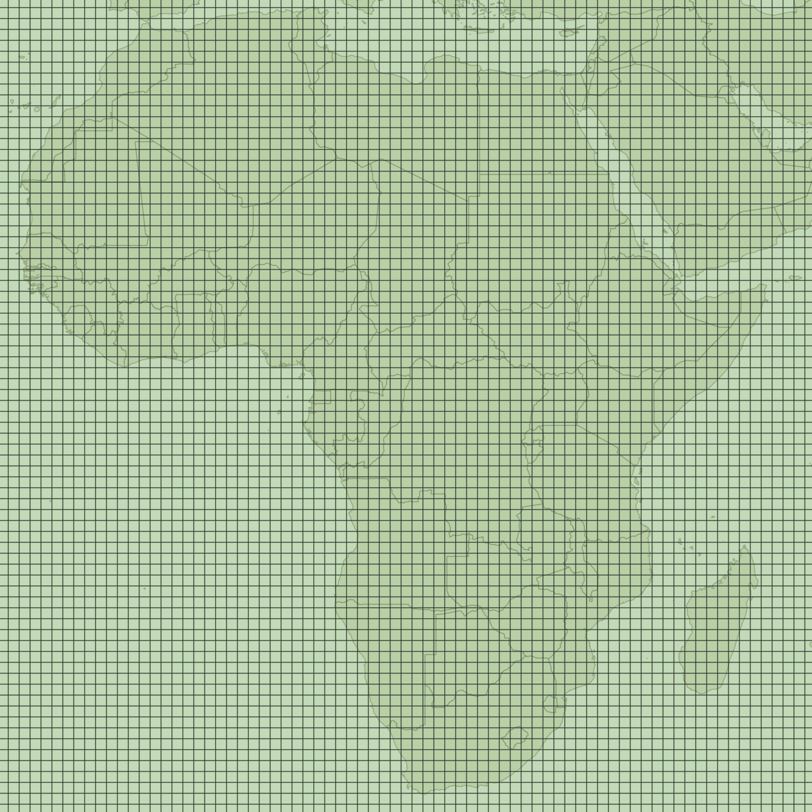
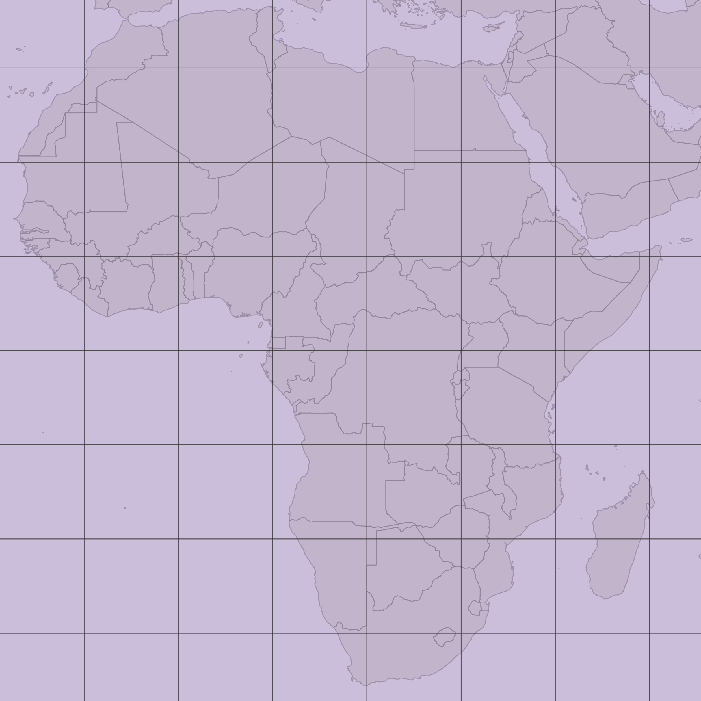
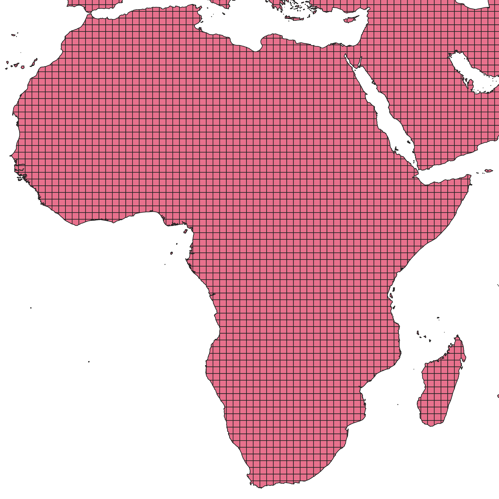
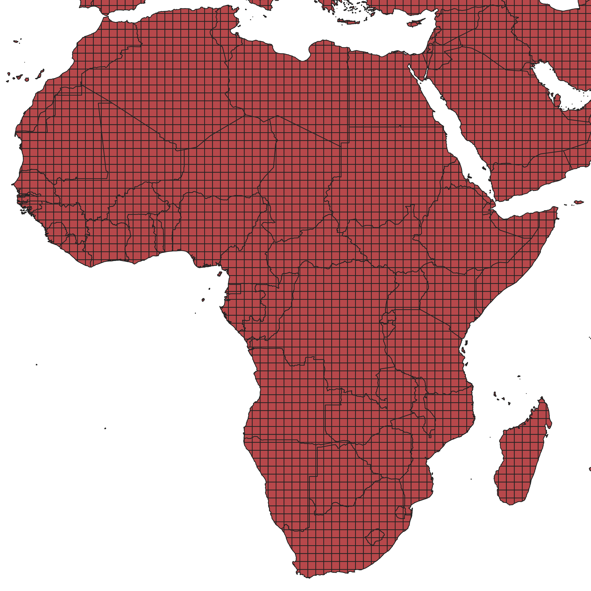
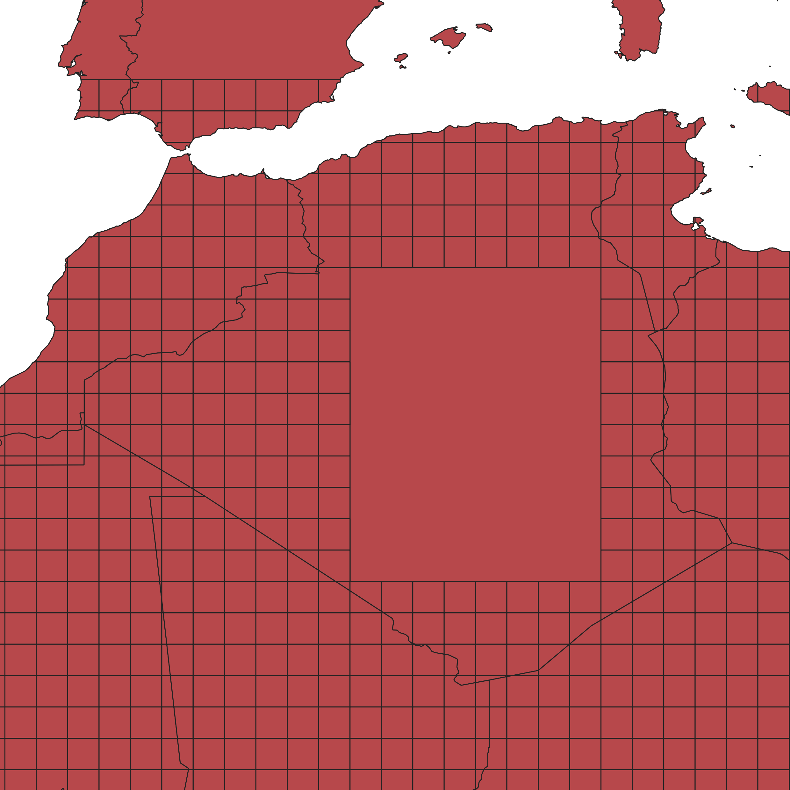

# Creating a Country-Based Grid for openrouteservice

This tutorial explains how to prepare a country-based grid dataset for openrouteservice.

## Step 1: Prepare the Country Data

1. Load your country dataset into **QGIS**.
2. If your data consists of multiple **GeoJSON** files, merge them into a single vector layer:
    * Go to **Vector → Data Management Tools → Merge Vector Layers**.
    * Under *Input Layers*, select all GeoJSON files.

## Step 2: Create Grids

You will create two rectangular grids covering the same extent as your country layer.

1. Go to **Vector → Research Tools → Create Grid**.
2. For the first grid:
    * Grid type: *Rectangle (Polygon)*
    * Grid extent: *Same as the country layer*
    * Horizontal/Vertical spacing : **10 degrees**
    * Grid: *hierarchy grid*
3. For the second grid:
    * Grid type: *Rectangle (Polygon)*
    * Grid extent: *Same as the country layer*
    * Horizontal/Vertical spacing: **1 degree**
    * Grid: *cell grid*

## Step 3: Assign Hierarchy IDs

Join the two grids so that each 1° cell knows which 10° cell it belongs to.

1. Go to **Vector → Data Management Tools → Join Attributes by Location**.
2. Set the parameters:
    * **Base layer:** cell grid
    * **Join layer:** hierarchy grid
    * **Geometric predicate:** *intersect*
3. Run the tool.
4. In the output, rename the joined field `id_2` to `hierarchy`:
    * Right-click the layer → *Properties → Fields* → click the *edit pencil* and rename.

## Step 4: Clip to Country Borders

1. Go to **Vector → Geoprocessing Tools → Clip**.
2. Set the parameters:
    * **Input layer:** grid created in the previous step
    * **Overlay layer:** country layer
3. Run the tool.

    * The output will be a grid clipped by country borders (some cells remain square, others follow borders).

## Step 5: Combine Country Names and Grid Attributes

1. Go to **Vector → Geoprocessing Tools → Union**.
2. Set the parameters:
    * **Input layer:** the clipped grid
    * **Overlay layer:** the country layer
3. Run the union.
    * This step combines country names with hierarchy and cell IDs.
    * It may take some time depending on your dataset size.

The attribute table should now look like this:

| id | hierarchy | NAME    |
| -- |-----------| ------- |
| 1  | 1         | Morocco |
| 2  | 1         | Morocco |
| 3  | 2         | Algeria |
| 4  | 2         | Algeria |
| 5  | 3         | Tunisia |
| 6  | 3         | Tunisia |
| 7  | 4         | Libya   |
| 8  | 4         | Libya   |
| 9  | 5         | Egypt   |
| 10 | 5         | Egypt   |

## Step 6: Export the Final Dataset

Export the final union layer as a **GeoJSON** file.
When exporting, ensure that at least the following fields are included:

* **name** – country name
* **hierarchy** – hierarchy ID

This GeoJSON file can now be used within openrouteservice or related workflows.

## Step 7 (optional): Manually merge inner country cells

By selecting and merging inner country cells, you can reduce the number of features in the final GeoJSON file.

