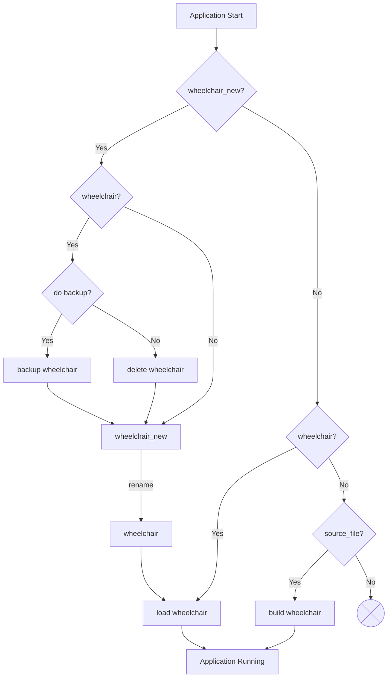

# Graph Repository Client

[//]: # (TODO: Can we come up with a consistent way to talk about it? "graph management" vs "graph repo client")

Since v9 openrouteservice includes a client for graph repositories. 
This makes it possible to download and use graphs built elsewhere instead of building them locally.
When using only graphs from a repository and configuring [ors.engine.graphs_data_acces](/run-instance/configuration/ors/engine/#ors-engine)=`MMAP`, 
it is now possible to run openrouteservice on pretty small machines even with planet data.

## Graph Repository

A openrouteservice routing graph is a complex data structure represented by a bunch of binary files.
The exact content of these files depends on many factors: 

* The software version of openrouteservice which built the graph. Since not every new openrouteservice version brings changes affecting graph building (build logic or graph structure), we use an internal parameter graphVersion to indicate whether graphs from older openrouteservice versions can be used.
* The geographic extent and version of the OSM data 
* The usage of additional data like traffic, elevation, country borders etc. 
* The exact configuration of the routing profile, e.g. all configuration parameters that are relevant for graph building

Because graph calculation is a very resource- and time consuming process, 
graphs can only be pre-calculated for some selected combinations of these parameters. 
The update schedule for the graphs is individual.

### Repository Structure

The graphs are stored in a tree structure based on these basic parameters: 

* **_Repository URI_:** The base URL (for a http repository) or path (for a file system repository)
* **_Repository Name_:** An editorial name representing the target group or vendor for the graphs. This is necessary to allow restricted access to graphs containing licensed or other non-public input data such as traffic data 
* **_Repository Profile-Group_:** A group of profiles with specific characteristics lke the usage of traffic data or the pre-calculation of advanced data structures e.g. for fastisochrones
* **_Repository Extent_:** The geographic region covered by the graph
* **_Graph Version_:** The version defining the exact structure of the graph files as well as the logic used to compute the contents 
* **_Encoder Name_:** Definition of the means of transportation, which determines specific steps/algorithms etc. during graph building. The _Encoder Name_ is no directory name in the repository, but part of the file names. 

A _timestamp_ or _data_version_ property is not used. 
When a graph is re-calculated with updated input data (OSM, traffic, ...), 
the old graph in the repository is replaced by the new one.
But openrouteservice can be configured to keep local backups of graphs, 
when a new graph is downloaded.

::: warning Attention
To avoid confusion: 
_Graph Version_ has nothing to do with the version of the underlying data that were used to calculate a graph (e.g. osm date)! 

It defines the version of the software that created a graph. 
There can be differences in the graph structure and in the build-logic, 
which means that a generated graph based on the identical input data is not the same for different graph versions. 

This also means, that an instance of openrouteservice can only load graphs created for the same _Graph Version_. 
Loading a graph of a different version could fail completely or at least would lead to unexpected or incorrect results. 

On the other hand, it is of course possible to generate new up-to-date graphs for older graph versions as well
and to host them in the repository for old versions of openrouteservice that are still running in the wild.
:::

The exact URL for a graph based on these parameters could look like this:
``` 
<Repository URI>/<Repository Name>/<Repository Profile-Group>/<Repository Extent>/<Graph Version>/<Encoder Name>               
```


### Repository Files

In the graph repository, each provided graph is available as a file containing the _Encoder Name_ and the extension `ghz`. This is a compressed archive file (zip for version 1) containing all files generated by openrouteservice graph building. 

Besides each `ghz` file there is one file with the same name and extension `yml` containing meta information about the graph. The most important value in this file is the `import_date` which is used by openrouteservice to check, if a graph in the repository is newer than the local graph. It can also be used by humans to get insights about the exact configuration parameters that were used to build a graph. 

::: details Example Repo Listing

In the following graph repository example there are graphs for three target groups:

* Public graphs covering europe for two routing profiles driving-car and foot-walking. There are graphs for the hypothetical graph versions 1, 2 and 3.
* A vendor "vendor_a" who runs several instances of openrouteservice for different purposes:
    * One openrouteservice with graph version 3 serving pedestrian routs for the planet,
    * one with cycling-regular, driving-car and driving-hgv routing in germany with fastisochrones support that still needs the older graph version 1 and
    * one for car- and truck routing in germany with traffic data
* A research project "project-b" with specific scientific data for switzerland and graph version 2.

```
http://repos.provider.com/graphs/                        # repo base URL
├── project-b                                            # repo name
│   └── basic                                            # profile group
│       └── switzerland                                  # coverage
│           └── 2                                        # graph version
│               ├── switzerland_2_cycling-mountain.ghz   # compacted graph
│               ├── switzerland_2_cycling-mountain.yml   # metadata
│               ├── switzerland_2_cycling-regular.ghz    # compacted graph
│               ├── switzerland_2_cycling-regular.yml    # metadata       
│               ├── switzerland_2_cycling-street.ghz     # compacted graph
│               └── switzerland_2_cycling-street.yml     # metadata       
├── public                                               # repo name       
│   └── basic                                            # profile group   
│       └── europe                                       # coverage        
│           ├── 1                                        # graph version   
│           │   ├── europe_1_driving-car.ghz             # compacted graph 
│           │   ├── europe_1_driving-car.yml             # metadata        
│           │   ├── europe_1_foot-walking.ghz            # ...
│           │   └── europe_1_foot-walking.yml
│           ├── 2
│           │   ├── europe_2_driving-car.ghz
│           │   ├── europe_2_driving-car.yml
│           │   ├── europe_2_foot-walking.ghz
│           │   └── europe_2_foot-walking.yml
│           └── 3
│               ├── europe_3_driving-car.ghz
│               ├── europe_3_driving-car.yml
│               ├── europe_3_foot-walking.ghz
│               └── europe_3_foot-walking.yml
└── vendor_a
    ├── basic
    │   └── planet
    │       └── 3
    │           ├── planet_3_foot-walking.ghz
    │           └── planet_3_foot-walking.yml
    ├── fastiso
    │   └── germany
    │       └── 1
    │           ├── germany_1_cycling-regular.ghz
    │           ├── germany_1_cycling-regular.yml
    │           ├── germany_1_driving-car.ghz
    │           ├── germany_1_driving-car.yml
    │           ├── germany_1_driving-hgv.ghz
    │           └── germany_1_driving-hgv.yml
    └── traffic
        └── germany
            └── 1
                ├── germany_1_driving-car.ghz
                ├── germany_1_driving-car.yml
                ├── germany_1_driving-hgv.ghz
                └── germany_1_driving-hgv.yml
```
:::


### Repository Types

There are two different repository types supported:

* **HTTP Repo:** The repo is served by a web server and is accessed via HTTP 
* **File System Repo:** The repo is a tree structure in the file system. The structure is exact the same as in the HTTP Repo. A file system repo could e.g. be a local mirror of a HTTP Repo.

The value in the configuration property `ors.engine.profiles.<profileName>.repo.repository_uri`
determines the repository type:

| Value                      | Repository Type |
|----------------------------|-----------------|
| `http://some.domain.ors`   | Http            |
| `https://some.domain.ors/` | Http            |
| `file:///absolute/path`    | File System     |
| `/absolute/path`           | File System     |
| `~/absolute/path`          | File System     |
| `relative/path`            | File System     |
| `file:relative/path`       | _Error_         |
| `file://relative/path`     | _Error_         |

::: tip Note
In a docker setup, the paths are evaluated inside the container!
:::
                                                 
### Update Cycles

The different graphs in a repository do not necessarily have a common update schedule.
Most likely, graphs of small extents are updated more frequently.
The `yml` files in the repository can be used to see the osm timestamp and the import date of each graph.


### Missing Graphs in Repository

If you need a specific graph and don't have the resources to calculate it yourself,
go in touch with us to discuss if we can calculate the required graphs for you and add them to the repository.


## Local Graphs

The local directory, where openrouteservice stores and loads graphs, is defined by the configuration property `graph_path` 
(in `ors.engine.profile_default` or in a single profile in `ors.engine.profiles.<profile>.graph_path`). 
The graphs are located in sub directories named like their routing profiles. 

E.g. with `ors.engine.profile_default.graph_path: /home/ors/graphs` and the enabled profiles `car` and `bike`, 
there would be this structure beneath `/home/ors/graphs`:
```
/home/ors/graphs
├── car
│   ├── ...
│   └── ...
└── bike
    ├── ...
    └── ...
```

This basic structure was there in openrouteservice versions before v9 and is still valid.
However, with graph management enabled, some more files and directories can be observed here. 
The following listing shows examples: 
```
/home/ors/graphs
├── car                    # currently active graph directory for car
├── car_new                # downloaded but not yet activated graph directory
├── car_2024-09-10_110905  # backup of old graph directory
├── bike                   # currently active graph directory for bike
├── bike_new_incomplete    # directory where downloaded bike graph is currently extracted
├── vendor-xyz_fastisochrones_heidelberg_1_driving-car.yml     # downloaded meta info file
├── vendor-xyz_fastisochrones_heidelberg_1_driving-car.ghz     # downloaded compressed graph
├── vendor-xyz_fastisochrones_heidelberg_1_cycling-regular.ghz # downloaded meta info file
└── vendor-xyz_fastisochrones_heidelberg_1_cycling-regular.yml # downloaded compressed graph
```
::: warning Hint
The downloaded `ghz` and `yml` files are stored with different names than in the repository
to avoid naming conflicts.
:::

The contents in `/home/ors/graphs` are managed by openrouteservice and should not be changed manually.
How this is done, is explained in the next sub chapters.


### Actions at Runtime

At regular times that are defined by a property `ors.engine.graph_management.download_schedule`,
openrouteservice checks for updated graphs in the repository (or repositories).
This is done by downloading and comparing the graph's tiny meta info `yml` file from the repository. 

If no updated graph is available, no more actions are performed until the next lookup.

If a new graph is available, the large `ghz` file is downloaded and extracted to a folder `<profile>_new_incomplete`,
which is renamed to `<profile>_new` after successful extraction. 

The new extracted graphs are not directly activated. 
Activation of new graphs is an independently scheduled process that is configured with the property `ors.engine.graph_management.activation_schedule`:
If a directory with the name `<profile>_new` exists, the application activates the new graphs. 
Graph activation causes a short period where the routing profile is not available. 
In production scenarios without redundancy it is therefore advisable 
to set a time that is outside times of high traffic.

If openrouteservice is still busy with downloading or extracting graphs from the repository during activation checks,
graph activation is blocked and the check will be repeated every minute until all graph update activities are finished.

Both, update checks and activation checks can be suppressed by placing lock files in the directory `graph_path`:

* `update.lock`
* `activation.lock`

If new graphs were not activated at runtime because no activation schedule is configured, activation was suppressed, 
or just because openrouteservice was stopped before the next scheduled graph activation time has come,
the new graph(s) will be activated on the next application start.
Even if graph management is not enabled ([ors.engine.graph_management.enabled](/run-instance/configuration/engine/graph-management.md))!

#### Logging

The openrouteservice logs print information when update checks or downloads are performed, 
when downloaded graphs wait for activation,
and when a process was suppressed because a lock file is present or because a graph management process is still active.

### Actions During Startup

In the classic mode without graph management, ORS loads available local graphs on startup or otherwise builds new graphs.

With the ORS graph management enabled, there are more situations possible. 
The absence of a local graph for a routing profile does not necessarily mean, that the graphs have to be built locally. 
And also when ORS is started, there can be more than one graph for each routing profile: 
The one that was active at the last run and also new downloaded and extracted graphs, 
partially downloaded or extracted graphs (after a network failure, system crash, out of memory…), 
and also backed up old graphs.

The following diagram shows the startup logic that es executed for each enabled routing profile.
For simplification we use only the routing profile `wheelchair` as an example:

The detailed backup logic is not shown in the diagram:
Graph folders are backed up by renaming. 
A timestamp suffix is added to the folder name of the active graph directory.
The current date is used for this. 
I.e. the backup directories have the backup date, 
not the osm date or graph build date as their timestamp.
Before doing so, 
the number of existing backups (existing directories `<profile>_<timestamp>`) is checked. 
If there is already the allowed maximum number of backups, 
the oldest backup directory is removed. 
This avoids that at any point in time more than `max_backups` graphs are stored, 
because graph directories can be very large.

In addition to backing up and activating graphs,
the startup process also wipes out incomplete files or directories (they could reside after a system crash).

## Configuration

### General Graph Management Setup

The general graph management is configured in the config properties beneatch [`ors.engine.graph_management`](/run-instance/configuration/engine/graph-management.md).

### Graph Management Setup for Profiles

To define a graph in the openrouteservice config, configuration parameters similar to the elements of the [repository structure](#repository-structure) are used
(see also [`ors.engine.profiles.<profile>.repo`](/run-instance/configuration/engine/profiles/repo.md)):

| Repo Path Parameter        | Configuration Parameter                                                               |
|----------------------------|---------------------------------------------------------------------------------------|
| _Repository URI_           | `ors.engine.profiles.<profileName>.repo.repository_uri`                               |
| _Repository Name_          | `ors.engine.profiles.<profileName>.repo.repository_name`                              |
| _Repository Profile-Group_ | `ors.engine.profiles.<profileName>.repo.repository_profile_group`                     |
| _Repository Extent_             | `ors.engine.profiles.<profileName>.repo.graph_extent`                                 |
| _Graph Version_            | _The graph version is determined by openrouteservice in use and cannot be configured_ |
| _Encoder Name_             | `ors.engine.profiles.<profileName>.encoder_name`                                      |

Only the _Graph Version_ cannot be configured, it depends on the version of openrouteservice. 

Repository settings that are common for multiple or all routing profiles can also be defined in `ors.engine.profile_default:`

::: details Configuration Example
In this configuration example, graph management is enabled and all three profiles use graph management,
because the repo parameters in `profile_default` are filled.
`ors.engine.profile_default.build.source_file` is empty to avoid that graphs are built locally if an expected graph is missing in the repository.
```yaml
ors:
  engine:
    graph_management:
      enabled: true
    profile_default:
      build:
        source_file:
      repo:
        repository_uri: http://graphs.provider.com/repos
        repository_name: repo1
        repository_profile_group: basic
        graph_extent: laos
    profiles:
      car:
        encoder_name: driving-car
        enabled: true
        repo:
          repository_profile_group: traffic
      heavy:
        encoder_name: driving-hgv
        enabled: true
        repo:
          repository_profile_group: traffic
      pedestrian:
        encoder_name: foot-walking
        enabled: true
```
Note that profiles `car` and `heavy` overwrite the default for _Repository Profile-Group_.
An openrouteservice version which supports graph version `1` will assemble the following graph repo addresses for the three profiles:

| Profile      | Graph in Repository                                                                  |
|--------------|--------------------------------------------------------------------------------------|
| `car`        | `http://graphs.provider.com/repos/repo1/traffic/laos/1/traffic_laos_1_driving-car.*` |
| `heavy`      | `http://graphs.provider.com/repos/repo1/traffic/laos/1/traffic_laos_1_driving-hgv.*` |
| `pedestrian` | `http://graphs.provider.com/repos/repo1/basic/laos/1/basic_laos_1_foot-walking.*`    |

:::

### Mixed Setups

It is also possible to have a mixed setup which includes both, local graph building for some profiles and graph download for other profiles within one instance of openrouteservice.

